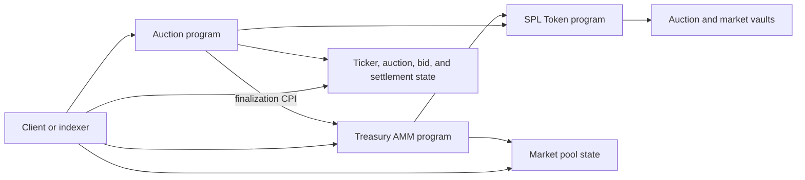

# Protocol architecture

FUTA turns each ticker into one on-chain lifecycle: registration, auction price discovery, settlement, and continuing Treasury AMM trading. Authoritative state and asset custody remain on Solana throughout that lifecycle.

## Program boundaries

Three programs form the core state and custody path:

| Program              | Responsibility                                                                                                                         |
| -------------------- | -------------------------------------------------------------------------------------------------------------------------------------- |
| Auction program      | Protocol configuration, ticker registration, mint creation, bids, live clearing, finalization, bidder claims, and auction creator fees |
| Treasury AMM program | Immutable market configuration, pool accounting, swaps, market fee accrual, and market fee claims                                      |
| SPL Token program    | Supply and quote mints, token accounts, vault balances, and token transfers                                                            |

The auction program invokes the Treasury AMM during finalization. Clients interact with each program directly after that boundary: auction claims remain auction-program operations, while swaps and market-fee claims are Treasury AMM operations.

The auction program also invokes the Metaplex Token Metadata program when it creates launch metadata and the creator fee-right NFT. The System Program creates accounts and is the derivation program for the deliberately unsignable permanent-reserve authority. Those auxiliary programs do not own FUTA's auction or market accounting.

An indexer or cache can make reads faster, but it is not part of the protocol's correctness path. Integrations can reconstruct authoritative state from Solana accounts and finalized transaction logs.

## State layers

FUTA separates global defaults, per-auction state, and per-market state.

### Global state

`ProtocolConfig` defines launch supply, auction timing, price-level spacing, ticker constraints, quote mint, mint decimals, the permanent-reserve policy version, and auction fee defaults. `LiquidityConfig` defines the market defaults copied during finalization.

Two of those are unlike the rest. Mint decimals are accepted only by `initialize_protocol` and cannot be changed afterwards, so every mint the protocol creates shares one precision. Fresh configuration accounts start with permanent-reserve policy version `1`; `set_reserve_policy_v1` exists to upgrade a pre-policy configuration. A configuration with no supported reserve policy fails closed.

Updating global state does not rewrite an existing auction or market.

### Ticker and auction state

A `TickerEntry` permanently maps the normalized ticker to its supply mint. `AuctionState` snapshots the creator, quote mint, auction supply, timing, price levels, auction fee rates, and permanent-reserve policy version.

Each ordinary bid has its own `BidState`. Aggregate quote demand is held in:

- `AuctionState.cum_lifting_bids` for demand strictly above the live clearing level;
- one paged `LevelBuckets` account for quote totals at each valid level.

This split lets bidding advance the clearing level incrementally without scanning every bid.

### Market state

Finalization creates:

- a Treasury AMM `Pool` containing inventory, circulation, backing, liquidity, invariant, fee-recipient shares, and claimable market fees;
- `PoolLiquidityConfig`, an auction-program snapshot of the market parameters;
- `PoolLiquidityState`, a record linking the auction result to the pool and its initial vault balances.

The Treasury AMM pool is the live source for post-auction trading state. The auction-program snapshots provide the launch-to-market link.

## Asset custody

The SPL Token program owns every token-account data record. Program-derived authorities control transfers.

| Authority                         | Controls                                                                                        |
| --------------------------------- | ----------------------------------------------------------------------------------------------- |
| Auction vault-authority PDA       | Supply and quote escrow during the auction; bidder and auction-fee transfers after finalization |
| Treasury AMM market-authority PDA | Market inventory and stable vault transfers                                                     |
| Permanent reserve authority       | Nothing. It is a System Program PDA with no signer, so its vault is immobile                    |
| `CreatorFeeRight` PDA             | Creator-fee transfers, on behalf of whoever holds the fee-right NFT                             |
| User signer                       | The user's source token accounts and bid ownership                                              |

At launch, the full fixed supply is minted into the auction token vault. Quote bids accumulate in one auction quote vault.

At finalization:

1. inventory assigned to the market moves into the market token vault;
2. net auction reserves move into the market stable vault;
3. the permanent reserve moves into a vault that nothing can sign for;
4. bidder token allocations remain in the auction vault until claimed;
5. refundable quote deposits and the creator auction fee remain in the auction quote vault until claimed;
6. mint authority is removed before the market is initialized.

The market treats sold-but-unclaimed auction allocations as circulating supply. They are liabilities of the auction vault even before bidders transfer them into personal token accounts.

It also treats the permanent reserve as circulating supply, but that portion is not a liability of anything. It is 1% of the auction allocation, withheld from bidder allocations and locked permanently. Because it can never be sold, circulating supply has a nonzero floor and no FUTA market can reach the Treasury AMM's complete-redemption state.

## Lifecycle and control flow

### 1. Configure

The protocol authority sets defaults for future launches and markets. These values are read and snapshotted at the relevant lifecycle boundary.

### 2. Launch

One auction instruction:

- validates and registers the ticker;
- creates the supply mint and auction vaults;
- mints the full fixed supply;
- creates the launch mint's Metaplex metadata when that CPI is enabled in the deployed build;
- opens `AuctionState`;
- escrows the creator's opening bid;
- creates the creator `BidState` and aggregate level ledger.

All effects commit together or not at all.

### 3. Bid

Bid placement, increase, and modification update the individual bid, shared quote escrow, aggregate level totals, cumulative lifting demand, and live clearing level in the same transaction.

The clearing level only advances. When it reaches a level, demand at that level stops counting as demand strictly above clearing.

### 4. Finalize

After the auction clock ends, any signer can finalize. The instruction:

- derives consumed proceeds from aggregate auction state;
- partitions protocol fees, creator fees, market reserves, refunds, the permanent reserve, and token claims;
- creates and funds the market vaults;
- removes mint authority;
- invokes the Treasury AMM initializer;
- snapshots settlement state and marks the auction finalized.

If market initialization or any earlier check fails, the Solana transaction rolls back as one unit.

### 5. Claim and trade

Bid claims are pull-based: each bidder settles their own `BidState` after finalization. Claims transfer tokens and refunds, then close the bid account.

The Treasury AMM is active as soon as finalization completes. It does not wait for every bidder to claim. Swaps move assets between users and market vaults while auction claims continue independently.

## Authority snapshots

The protocol separates rules for future markets from rules already accepted by participants:

- auction fee rates, quote mint, and permanent-reserve policy version are fixed on `AuctionState` at launch;
- Treasury AMM fee-recipient shares, creator, fee recipient, mints, and vaults are fixed in the pool at initialization;
- changing global configuration affects later auctions or markets, not existing ones.

The protocol authority can update global launch policy and receive the configured protocol fee streams. It cannot use those configuration instructions to rewrite an existing Treasury AMM pool.

## Integration boundaries

The auction program uses Anchor encoding for its ordinary accounts, instructions, errors, and events. Two parts sit outside that generated interface:

- `LevelBuckets` uses a manual paged byte layout;
- the Treasury AMM uses a native Borsh instruction and account interface.

A complete client therefore joins the auction IDL with the manual level-bucket and Treasury AMM contracts. Events are useful for discovery, but integrations should reconcile affected accounts because several state transitions do not emit dedicated events.

See [Accounts](../reference/accounts.md), [Instructions](../reference/instructions.md), and [Events](../reference/events.md) for the exact contracts.
